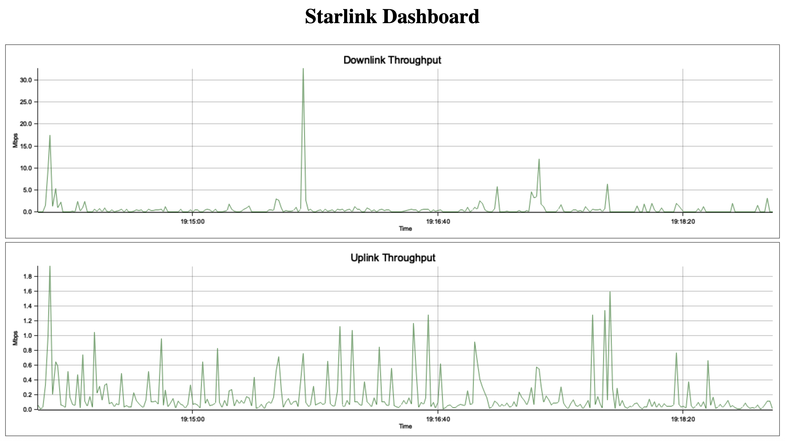

## Project Overview

This project provides a simple web dashboard for real-time monitoring of your Starlink Gen 3 Dish and Router using gRPC streaming.

It builds on [`starlink-grpc-client`](https://github.com/andywwright/starlink-grpc-client) and runs as a local web server showing live metrics including:

- Download and upload speeds (WIP)

## Features

- **Real-time gRPC streaming support**
- **Web-based dashboard accessible via browser**
- **Data charts for easy visualization**

## Usage

### 1. Clone the repository

```bash
git clone https://github.com/andywwright/starlink-web-dashboard.git
cd starlink-web-dashboard
```

### 2. Run the server

```bash
cargo run
```

By default, the server runs on [http://localhost:8080](http://localhost:8080).

### 3. Access the Dashboard

Open your browser and navigate to:

```
http://localhost:8080
```

## Troubleshooting

- Ensure your Starlink hardware is powered and reachable on the local network.
- Make sure `starlink-grpc-client` dependencies are correctly configured.
- If running on a non-macOS system, adjust build scripts as necessary.

## License

MIT License. See `LICENSE` file for details.
